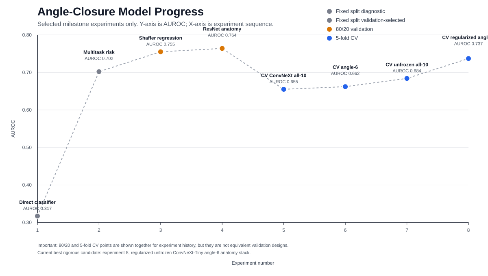

# AUROC Progress Chart

This chart tracks only the milestone experiments that changed the modeling direction or produced a meaningful AUROC jump.



Update workflow:

```bash
python Glaucoma-Screening/scripts/update_experiment_progress_chart.py
```

Source data: `Glaucoma-Screening/results/experiment_progress_milestones.csv`.

Important: fixed-split, 80/20, and 5-fold CV points are shown together for history. They should not be interpreted as directly equivalent evidence.

| # | Method | Validation | AUROC | Sens | Spec | Why it matters |
| ---: | --- | --- | ---: | ---: | ---: | --- |
| 1 | Whole-image direct binary classifier | Fixed split diagnostic | 0.317 | 0.250 | 0.630 | Weak direct classifier; pushed us away from plain binary heads. |
| 2 | Image multitask model plus shallow anatomical risk | Fixed split validation-selected | 0.702 | 0.875 | 0.630 | First useful jump from predicting anatomy-related outputs instead of only class probability. |
| 3 | Weighted Shaffer-grade regression with balanced threshold | 80/20 validation | 0.755 | 0.700 | 0.755 | Continuous grade prediction improved the simple image-only signal. |
| 4 | ResNet-50 predicts 10 AS-OCT anatomy targets; logistic risk | 80/20 validation | 0.764 | 0.714 | 0.721 | Best quick 80/20 strict-label anatomy-stack signal. |
| 5 | Frozen ConvNeXt-Tiny predicts all 10 anatomy targets; mean eye aggregation | 5-fold CV | 0.655 | 0.657 | 0.642 | First rigorous 5-fold ConvNeXt baseline; lower than 80/20 because validation is stricter. |
| 6 | Frozen ConvNeXt-Tiny with angle-focused 6 anatomy targets | 5-fold CV | 0.662 | 0.663 | 0.654 | Small gain from focusing targets on ACD/lens vault/AOD/TISA. |
| 7 | Unfrozen ConvNeXt-Tiny all-10 anatomy model | 5-fold CV | 0.684 | 0.679 | 0.668 | Backbone adaptation improved AUROC but showed overfitting. |
| 8 | Regularized unfrozen ConvNeXt-Tiny with angle-6 targets | 5-fold CV | 0.737 | 0.707 | 0.722 | Best current 5-fold result; first mean sensitivity and specificity both above 0.70. |

## Milestone Summaries

These short summaries explain how each experiment changed the next step. The goal is to keep the development logic visible, not just list scores.

### 1. Direct classifier

**Question:** Can a standard image-only binary classifier separate strict Shaffer 0/1 from 2/3/4?

**Approach:** Train a direct class-probability model from slit-lamp images using the strict binary closure label.

**Result:** AUROC 0.317, sensitivity 0.250, specificity 0.630. Validation design: Fixed split diagnostic. Run path: `slit-project/paper2_runs/angle_closure_image_only_cls`.

**Interpretation:** The direct class head did not find a reliable signal and likely suffered from class imbalance and label ambiguity.

**Decision:** Stop using plain whole-image binary classification as the main route.

### 2. Multitask risk

**Question:** Does forcing the image model to predict anatomy-related outputs improve closure screening?

**Approach:** Train an image multitask model and evaluate a shallow risk model from predicted anatomical outputs rather than relying only on direct probability.

**Result:** AUROC 0.702, sensitivity 0.875, specificity 0.630. Validation design: Fixed split validation-selected. Run path: `slit-project/paper2_runs/angle_closure_image_only_multitask`.

**Interpretation:** Anatomy-related predictions carried more useful signal than a direct binary head, but specificity remained too low for balanced classification.

**Decision:** Move toward anatomy-first models and shallow risk rules.

### 3. Shaffer regression

**Question:** Can predicting the continuous Shaffer grade use more label information than binary classification?

**Approach:** Train a weighted ResNet-50 regression model to predict Shaffer grade 0-4 and convert predicted grade to closure risk with a balanced threshold.

**Result:** AUROC 0.755, sensitivity 0.700, specificity 0.755. Validation design: 80/20 validation. Run path: `slit-project/paper2_runs/angle_grade_regression_80_20_weighted_fast`.

**Interpretation:** Grade regression improved rank discrimination, but the fixed clinical cutoff 1.5 was not calibrated because predicted grades were shifted upward.

**Decision:** Keep ordinal/continuous targets as useful signal but require calibration before clinical thresholding.

### 4. ResNet anatomy

**Question:** Are AS-OCT biomarker predictions a stronger intermediate target than Shaffer grade alone?

**Approach:** Train ResNet-50 to predict 10 AS-OCT anatomical parameters, aggregate predicted anatomy to eye level, then fit logistic regression for strict closure.

**Result:** AUROC 0.764, sensitivity 0.714, specificity 0.721 on strict 0/1 vs 2/3/4. Validation design: 80/20 validation. Run path: `slit-project/paper2_runs/resnet50_anatomy_stack_80_20_fast`.

**Interpretation:** The anatomical biomarker stack gave the best quick 80/20 balance and confirmed that image-predicted anatomy is the main signal.

**Decision:** Use anatomy-stack regression as the main modeling family.

### 5. CV ConvNeXt all-10

**Question:** Does the anatomy-stack signal survive stricter patient-level 5-fold validation?

**Approach:** Train frozen ConvNeXt-Tiny to predict all 10 anatomy targets and average per-image predictions to eye level before logistic risk modeling.

**Result:** Mean 5-fold AUROC 0.655, sensitivity 0.657, specificity 0.642. Validation design: 5-fold CV. Run path: `slit-project/paper2_runs/exp4_convnext_tiny_anatomy_stack_cv_complete476`.

**Interpretation:** The signal remained real but weaker than the quick 80/20 result, showing the earlier fixed split was optimistic.

**Decision:** Use patient-level CV for robustness claims and treat 80/20 results as development signals.

### 6. CV angle-6

**Question:** Can removing less relevant anatomy targets reduce noise and improve strict closure screening?

**Approach:** Train frozen ConvNeXt-Tiny only on angle-relevant anatomy targets: ACD, lens vault, AOD500 nasal/temporal, and TISA500 nasal/temporal.

**Result:** Mean 5-fold AUROC 0.662, sensitivity 0.663, specificity 0.654. Validation design: 5-fold CV. Run path: `slit-project/paper2_runs/exp7_convnext_tiny_angle6_anatomy_stack_cv_complete476`.

**Interpretation:** Target focus produced a small balanced-min gain and improved AUPRC, suggesting less noisy supervision helps.

**Decision:** Prefer angle-focused anatomy targets over the full 10-target set for the next model.

### 7. CV unfrozen all-10

**Question:** Does fine-tuning ConvNeXt features improve over frozen ImageNet features?

**Approach:** Unfreeze ConvNeXt-Tiny and train the all-10 anatomy model for a short schedule with early stopping.

**Result:** Mean 5-fold AUROC 0.684, sensitivity 0.679, specificity 0.668. Validation design: 5-fold CV. Run path: `slit-project/paper2_runs/exp8_convnext_tiny_unfrozen_anatomy_stack_cv_complete476`.

**Interpretation:** Unfreezing improved AUROC, but validation losses suggested fast overfitting and balanced-min did not improve beyond angle-6 frozen.

**Decision:** Fine-tuning is useful, but it needs stronger regularization and fewer focused targets.

### 8. CV regularized angle-6

**Question:** Can combining focused targets with regularized ConvNeXt fine-tuning reach the 70/70 target?

**Approach:** Train unfrozen ConvNeXt-Tiny on angle-6 anatomy targets with lower learning rate and higher weight decay, then use mean eye-level anatomy predictions plus logistic risk.

**Result:** Mean 5-fold AUROC 0.737, sensitivity 0.707, specificity 0.722. Validation design: 5-fold CV. Run path: `slit-project/paper2_runs/exp9_convnext_tiny_unfrozen_angle6_regularized_cv`.

**Interpretation:** This is the best current 5-fold candidate and the first mean result above 70/70, but fold 1 remains weak and threshold calibration is not stable enough for a final claim.

**Decision:** Make this the leading candidate; next work should inspect fold-1 errors and improve threshold calibration.
